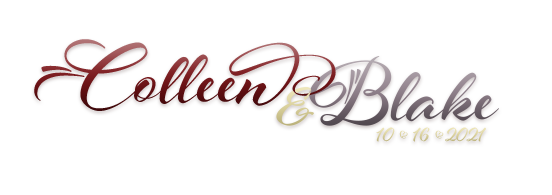

# Colleen and Blake's Wedding App
An App for Colleen Kelley and Blake Young's wedding.

   _By Mimi Netto_

## Minimum Viable Product
- [x] A git repository not inside the class repo.
- [x] Be deployed online** and accessible to the public.
- [x] *link to your hosted working app* [Heroku](https://colleen-blake-wedding.herokuapp.com/)
- [x] Successful Cors [Repo for API](https://github.com/mimnetto/guestbook_backend)
- [x] *teach yourself something new*  MERN Stack (Mongo, Express, React, Node) using Create React App.

## Technologies, Approaches, Fails and Wins

### Tech & Approaches
* Responsive Design
* Custom css
  * Although I wish I had better organized it, most of the CSS is my own.

### Struggles
* CORS
  * Connecting the backend to the front end was my biggest channel and it took up a very big chunk of time. The ID's was a huge problem to solve.
* The amount of time every little thing took
  * It just felt like every time I want to add a new component (navbar, header, modal etc), it took an entire day, at least. I just wasn't able to do as much as I wanted and had to admit defeat on many things. I wish I had just a few more days to get this where I want it.
* NPM installs
  * It just got overwhelming. I trashed my first react app after a few days because I felt I installed to much and was losing track of stuff.
* Feeling Overwhelmed
  * Especially at first. Every time I sat down I just wanted to cry.

### Failed Attempts
* Ruby on Rails backend
  * It was just too much for me to learn Create React *and* Ruby in a just a little over a week. I spend a day and a half trying to connect the Rubu backend with React from end but felt I had broke the backend to the point of no return so I went with MERN since I'm more familiar with it.
* Many React Component Attempts
  * Couldn't get a thank you message to replace the form after submit
  * Couldn't get the Modals to close after submit

### Wins!
* I learned ***ALOT***
  *  I was getting very discouraged half way through this project because I felt like I had been working none stop and had almost nothing to show for it but by Sunday night react was really starting to click and make sense. I really feel like most of this project was learning rather than creating
* It works with no errors!
* Starting to get what Karolin means when she says that you eventually realize you can do whatever you want with stuff. There were some things I tried doing with librarys like bootstrap and then just ended up making my own code.

## Going Forward
I will be making this website in full. I kept on thinking about how instructors mentioned sometimes you really don't need to use all that fancy react stuff for your project's goal. But since I really wanted to learn Create React, I stuck with it but I *do* feel like a simpler approach will be better for this app in the long run.

##### Me going into this project

  
For General Assembly SEIR 810 Moss!
